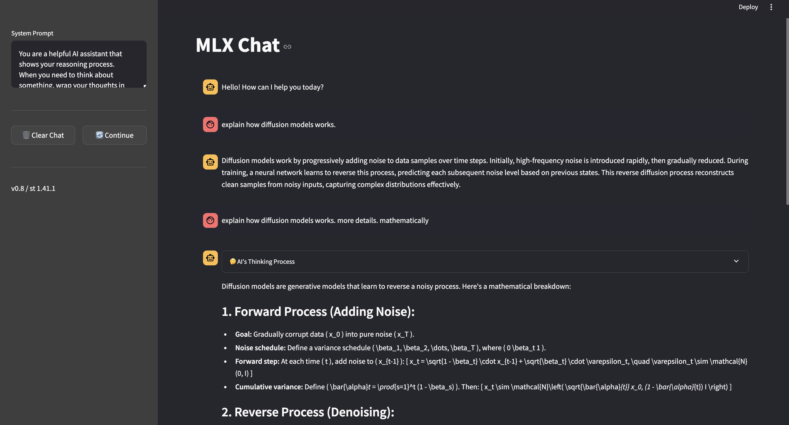

# MLX Chat UI with Reasoning Models

A sleek, dark-themed chat interface for MLX models with support for reasoning mode.

## Features

- **Dual Model Support**: Switch between standard chat mode and reasoning mode
- **Dark Theme UI**: Modern dark-themed interface similar to ChatGPT
- **Reasoning Process Display**: View the AI's thinking process in reasoning mode
- **Responsive Design**: Works well on different screen sizes
- **System Prompt Customization**: Modify the system prompt for different use cases
- **Conversation Management**: Clear chat history or continue generating from previous responses

## Models

The application includes two pre-configured models:

- **Standard Chat Mode**: [EXAONE-3.5-2.4B-Instruct-4bit](https://huggingface.co/mlx-community/EXAONE-3.5-2.4B-Instruct-4bit) - A lightweight but capable model for general conversations
- **Reasoning Mode**: [QwQ-32B-4bit](https://huggingface.co/mlx-community/QwQ-32B-4bit) - A larger model with the ability to expose its reasoning process

Both models are optimized for MLX and run efficiently on Apple Silicon devices.

## Installation

### Prerequisites

- Python 3.8+
- MLX library and its dependencies
- Conda (recommended for environment management)
- Apple Silicon Mac (M1/M2/M3) for optimal performance

### Setup

1. Clone the repository:
   ```bash
   git clone https://github.com/yourusername/mlx-ui.git
   cd mlx-ui
   ```

2. Run the installation script:
   ```bash
   ./install.sh
   ```
   This will create a conda environment named `mlx-ui-env` with all necessary dependencies.

## Usage

1. Start the application:
   ```bash
   ./run.sh
   ```

2. The application will open in your default web browser at `http://localhost:8501`

3. Choose a model mode:
   - **Standard Mode**: Regular chat without showing reasoning process
   - **Reasoning Mode**: Shows the AI's thinking process in an expandable section

4. Type your message in the input field and press Enter to send

5. Additional controls:
   - Clear the conversation using the "Clear Chat" button in the sidebar
   - Continue generation from the last response using the "Continue" button
   - Customize the system prompt in the sidebar

## Technical Details

### Architecture

The application is built using:

- **Streamlit**: For the web interface
- **MLX**: For efficient model inference on Apple Silicon
- **Python**: For the backend logic

### Key Components

- `app.py`: Main application file
- `install.sh`: Setup script for creating the conda environment
- `run.sh`: Script to launch the application

### User Interface

The UI is designed with a dark theme and consists of:

- Chat message area displaying the conversation history
- Input field for entering messages
- Model selector for switching between standard and reasoning modes
- Sidebar with system prompt customization and conversation controls

## Customization

You can customize the application by:

1. Modifying system prompts in the `SYSTEM_PROMPTS` dictionary
2. Changing the models in the `MODELS` dictionary
3. Adjusting the UI styles in the CSS section

## License

[Your License Here]

## Acknowledgements

- MLX Team for the model inference library
- Streamlit for the web app framework
